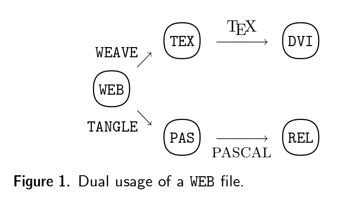
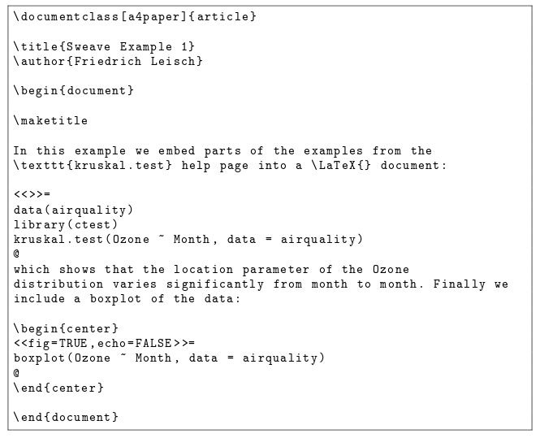

# Intro

## Que es _reproducible research_? {.build}

_"Creo que metimos los datos que no eran!"_

_"Como es que generamos esta gráfica?"_

_"De donde vienen esos datos? Creo que toca actualizarlos!"_

_"Y este error qué? Antes no salia!"_

[Basdo en notas de Karl Broman](https://www.biostat.wisc.edu/~kbroman/presentations/repro_research_RDS2015.pdf)

## Que es _reproducible research_?

[De wikipedia (en inglés)](https://en.wikipedia.org/wiki/Reproducibility#Reproducible_research):

_"El termino investigación reproducible (_reproducible research_) se refiere a la idea de que el producto final de una investigación ~~academica~~ es el artículo en conjunto con todo el ambiente computacional usado para producir los reseltudas en el articulo como el codigo, los datos, etc. que pueden ser usados para **reproducir** los resultados y crear nuevo trabajo basado en la investigación."_

Ver por ejemplo [_WaveLab and Reproducible Research_](https://statistics.stanford.edu/sites/default/files/EFS%20NSF%20474.pdf) en particular las anecdotas en la sección 2.

## Que es _reproducible research_?

Rproducibilidad vs replicabilidad.

Reproducible vs valido.

[De wikipedia (en inglés)](https://en.wikipedia.org/wiki/Reproducibility):
_Reproducibilidad es la capacidad de un **experimento** o **estudio**  de ser duplicado. ... Hablamos de **replicar** un experimento cuando este se reproduce. La reproducibilidad es uno de los principios fundamentales del metodo cientifico._

## Por qué _reproducible research_?

>- Para colaborar.
>- Por uno mismo!
>- Por la ciencia y su desarrollo.
>- Para fomentar la transparencia.

## Sobrevuelo histórico | Raices

- Stanford:
    - [Donald Knuth](http://cs.stanford.edu/~uno/) y la idea de [_Literate programming_](https://en.wikipedia.org/wiki/Literate_programming): http://www.literateprogramming.com/
    - [_Stanford Exploration Project_](http://sepwww.stanford.edu/doku.php?id=sep:research:reproducible)
    - [WaveLab](http://statweb.stanford.edu/~wavelab/)

- [`WEB`](http://www.literateprogramming.com/knuthweb.pdf) la primera implementación de _literate programming_: $\TeX$ + PASCAL.

- [`noweb`](https://www.cs.tufts.edu/~nr/noweb/) por [Norman Ramsey](http://www.cs.tufts.edu/~nr/)  _literate programming_ simple, extensible, independiente de lenguajes.

Mucho más en: http://reproducibleresearch.net/links/

## Sobrevuelo histórico

[](http://www.literateprogramming.com/knuthweb.pdf "WEB")

## Sobrevuelo histórico | Sweave

[Sweave](http://www.statistik.lmu.de/~leisch/Sweave/) por [Friedrich Leisch](http://www.statistik.lmu.de/~leisch/) sintaxis de `noweb` con $\LaTeX$ + S (i.e. R)

```r
help("Sweave", package="utils") 
```

## Sobrevuelo histórico

<div class="centered">
[](http://www.statistik.lmu.de/~leisch/Sweave/Sweave-manual.pdf "WEB")
</div>

## Sobrevuelo histórico | knitr

[knitr](http://yihui.name/knitr/): _a [neater](https://github.com/yihui/knitr#motivation) versión of Sweave_

## Sobrevuelo histórico | rmarkdown

Documentos dinamicos con R:

[RMarkdown](http://rmarkdown.rstudio.com/) = knitr con [markdown](https://daringfireball.net/projects/markdown/) + [pandoc](http://pandoc.org/) =

<div class="centered">
[](http://rmarkdown.rstudio.com/ "WEB")
</div>

## Sobrevuelo histórico | Jupyter (antes iPython) 

[Jupyter](http://jupyter.org/) (antes [iPython](http://ipython.org/)): computacioón interactiva independiente del lenguaje - [_kernels_](https://github.com/ipython/ipython/wiki/IPython-kernels-for-other-languages). ([Como instalar](http://jupyter.readthedocs.org/en/latest/install.html#install))

Jupyter con Python y su _stack_ para computo cientifico [SciPy](http://www.scipy.org/) / [Anaconda](https://www.continuum.io/why-anaconda) han desarrollado un ambiente muy valioso para analisis de datos abierto: e.g. [Google deep-dream](https://github.com/google/deepdream/blob/master/dream.ipynb)

[iRkernel](irkernel.github.io) - _kernel_ de R para Jupyter.


## Algunas herramientas y flujos de trabajo | Investigación reproducible es mucho más

Pero hacer _reproducible research_ bueno o util requiere más que entrelazar prosa y codigo.

Niveles de calidad:

- Se pueden reproducir (regenerar) las tablas y graficas?
- Coincide el codigo con lo que dice la documentación?
- Se explica claramente por qué se hace lo que se hace? (e.g. selección de parametros)
- Sirve el codigo con otros datos?
- Se puede extender el codigo para hacer otras cosas?

## Algunas herramientas y flujos de trabajo | [Recomendaciones generales](http://kbroman.org/steps2rr/) {.left-margin}

>- Todo programado
>- Organizar datos y codigos - [definir una estructura](http://stats.stackexchange.com/a/3191) (e.g. [LCFD](http://stackoverflow.com/a/1434424), [ProjectTemplate](http://projecttemplate.net), [Paquetes](http://stackoverflow.com/a/1266400) [no es tan dificil](http://r-pkgs.had.co.nz))) y [una](http://www.stat.ubc.ca/~jenny/STAT545A/block19_codeFormattingOrganization.html#coding-style) [guia](https://google.github.io/styleguide/Rguide.xml) [de estilo](http://adv-r.had.co.nz/Style.html)
>- Automatizar los procesos ([GNU Make](https://www.gnu.org/software/make/))
>- Reportes reproducibles - _literate **analysis** + programming_ (rmarkdown!)
>- _No repetirse_: encapsular codigo reutilizable en funciones.

## Algunas herramientas y flujos de trabajo | [Recomendaciones generales](http://kbroman.org/steps2rr/) {.left-margin}


>- Encapsular las funciones en paquetes/modulos (documentando _literate programing_ con [roxygen2](https://cran.r-project.org/web/packages/roxygen2/)!) - (extensibilidad y portabilidad).
>- Sistemas de control de version ([git](https://git-scm.com/) + [GitHub](https://github.com/)/[bitbucket](https://bitbucket.org/)) - el problema del [_not Final doc_](http://www.phdcomics.com/comics/archive.php?comicid=1531) 
>- Portabilidad: manejo de dependencias / ambientes virtuales (e.g. [packrat](https://rstudio.github.io/packrat/), [Docker](https://www.docker.com/) + [rocker](https://github.com/rocker-org/rocker))
>- Validez del codigo (y de los datos!): pruebas [testthat](https://github.com/hadley/testthat) y [testdat](https://github.com/ropensci/testdat). Ver [_testing for data science_](https://slides.com/treycausey/pydata2015) con Python.
