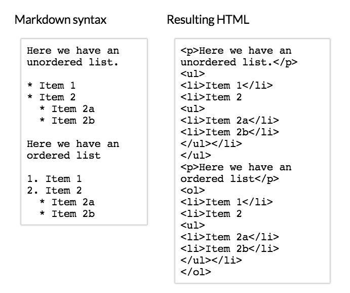
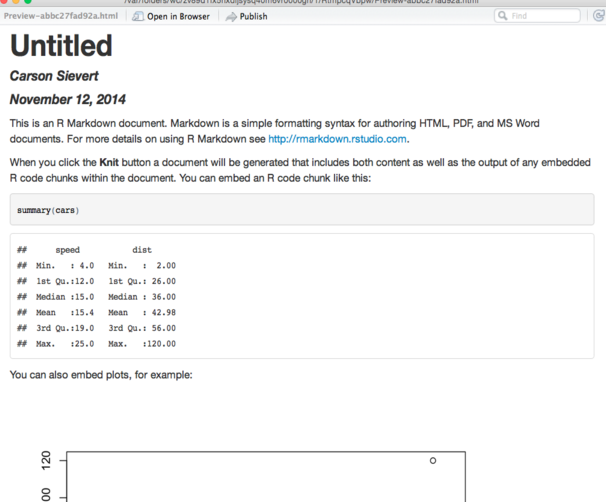
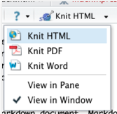

# rmarkdown

## ¿Cómo se hacen reportes reproducibles en R?

Knitr + markdown + pandoc = rmarkdown

- rmarkdown: Paquete de Rstudio
- Funciona con un click dentro del IDE Rstudio

## ¿Por qué usar markdown?

- Fácil de aprender y usar.
- Mantener la atención en el contenido y no en lo estético.
- Flexible... inicialmente para HTML pero se puede convertir a diferentes formatos

## ¿Qué es markdown?

- Markup language: diseñados para producir contenidos con texto plano
- Ejemplo: Latex... markup language para crear pdf's
- Convertir a varios formatos (HMTL/pdf/word)

## Markdown - HTML


## Markdown - HTML



## Knitr y Pandoc

- Knitr: Mejora sobre Sweave. Renderizar reportes que a su vez corran código. Ejemplo de uso: publicaciones científicas - actualizar gráficos
- Pandoc: La navaja suiza para convertir documentos...  markdown, reStructuredText, textile, HTML, DocBook, LaTeX, MediaWiki markup, TWiki markup, OPML, Emacs Org-Mode, Txt2Tags, Microsoft Word docx, LibreOffice ODT, EPUB


## ¿Cómo se escribe en formato rmarkdown (.Rmd)?

- Yaml frontmatter
- Chunks
- Markdown normal


## Chunks

Los chunks son conceptos que vienen del paquete knitr.  
Comienzan con tres __back ticks__ y `{r }`
  
  ```{r chunk1}
  1 + 1
  ```
  #> [1] 2

Tiene múltiples opciones dependiendo de lo que se quiera a la salida.

`echo, eval, message, warning, results, fig.width, fig.height...`

Ver opciones http://yihui.name/knitr/options/

## Yaml front matter

Lo que va al comienzo del archivo `.Rmd`
Se pueden definir formatos y otras propiedades, incluso definir parámetros para automatizar reportes.

```
  ---
  title: "Hola, soy Rmarkdown"
  date: "2016-02-17"
  output: html_document
  ---
```


## ¿Resultado?



## ¿Cómo se compila?



## ¿Cómo se compila sin ayuda de Rstudio?

```r
library(rmarkdown)
render("index.Rmd")
browseURL("index.html")
```

## Nuestro turno: Primero lo primero:

```r
install.packages(c("knitr", "rmarkdown"))
```

## Nuestro turno

```
  Title
  ====================
  
  This is an R Markdown document.
  
  ```{{r results='asis'}}
  library(knitr)
  kable(head(cars), 'html')
  ```
  
  You can also embed plots, for example:
  
  ```{{r fig.width=7, fig.height=6, echo=FALSE}}
  plot(cars)
  ```
```

## ¿Qué más? Tablas interactivas


## ¿Qué más? Gráficos interactivas


```
  library(plotly)
  p <- ggplot(data = d, aes(x = carat, y = price, colour = clarity)) +
    geom_point(aes(text = cut), size = 3) + geom_smooth() + facet_wrap(~ clarity)
  ggplotly(p)
```

## Otros ejemplos

- Estilo Tufte: [HTML](http://cran.r-project.org/web/packages/tufterhandout/vignettes/example.html), [pdf](http://rmarkdown.rstudio.com/examples/tufte-handout.pdf) documents.

- Kmeans  https://rpubs.com/dnchari/kmeans

- Mapas y proyecciones https://rpubs.com/hrbrmstr/coord_proj_stress_test

- Htmlwidgets de Redes https://rpubs.com/yoshio/99778

## Rmarkdown avanzado

- Opciones globales
  `knitr::opts_chunk$set(message = FALSE, warning = FALSE)`

- Pasar parámetros http://rmarkdown.rstudio.com/developer_parameterized_reports.html 
```
  params:
    start: !r as.Date("2015-01-01")
    snapshot: !r as.POSIXct("2015-01-01 12:30:00")
```
- Documentos reactivos (embeber shiny): http://rmarkdown.rstudio.com/authoring_shiny.html)

- Cambiar el template de html: http://rmarkdown.rstudio.com/developer_document_templates.html


## Otros recursos

- https://github.com/cpsievert/slides
- http://rmarkdown.rstudio.com
- http://www.rstudio.com/ide/docs/authoring/using_markdown
- http://yihui.name/knitr/

## Gracias!

No olvidar

```
sessionInfo()
```

O mejor

```
devtools::session_info()
```


